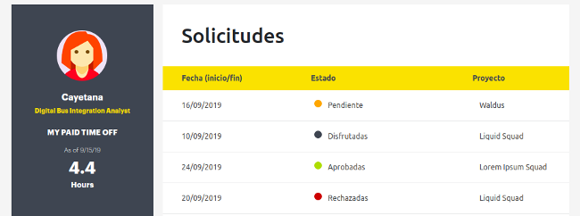

## Liquid Holiday Manager

Aplicación web para gestionar las vacaciones de los empleados de [Liquid Squad](https://www.accenture.com/es-es/service-liquid-squad-accenture-digital). Consta por un lado de la parte de solicitante y por otro la parte del gestor encargado de aprobar o rechazar cada solicitud.

### Pasos para utilizar la aplicación:

1. npm install
2. npm install --save react-router-dom node-sass prop-types
3. npm start

### Desarrollado con:

- React
- SASS
- Bootstrap

## Equipo - AQUA SQUAD -

1. Ana Amaro: 

  - [GitHub](https://github.com/AnaAmaro)
  - [LinkedIn](https://www.linkedin.com/in/anaamarovazquez/)
  
2. Isabel Pizarro: 

  - [GitHub](https://github.com/IsabelPizarro)
  - [LinkedIn](https://www.linkedin.com/in/isabelpizarronogales/)

3. Laura Pareja: 

  - [GitHub](https://github.com/laurapareja)
  - [LinkedIn](https://www.linkedin.com/in/laurapareja/)

4. Luz Aguirre: 

  - [GitHub](https://github.com/luzagm)
  - [LinkedIn](https://www.linkedin.com/in/luzaguirremorales/)

5. Sara Marín: 

  - [GitHub](https://github.com/saramarin23)
  - [LinkedIn](https://www.linkedin.com/in/saramarin/)

